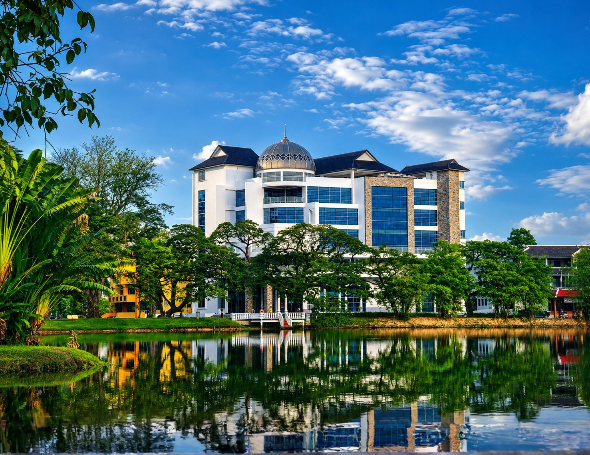
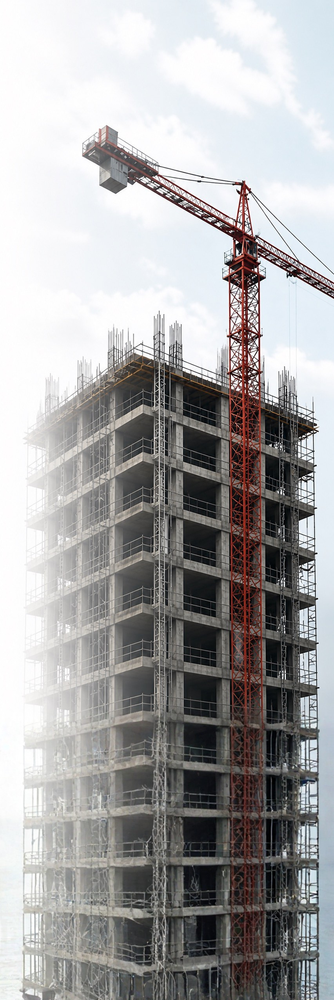
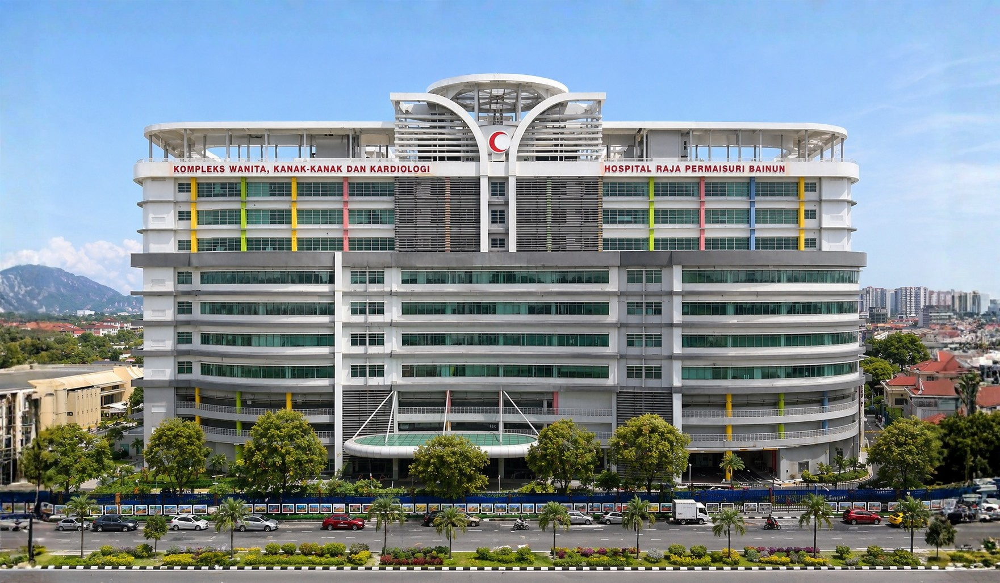
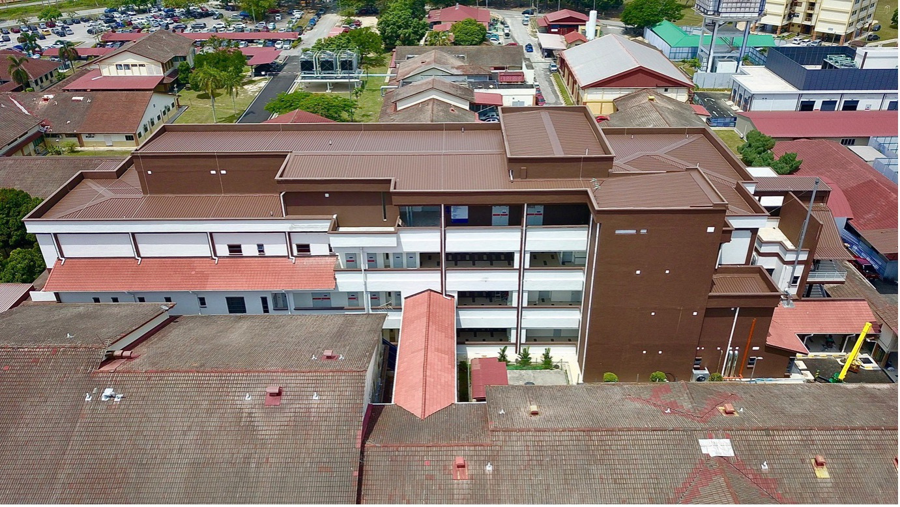
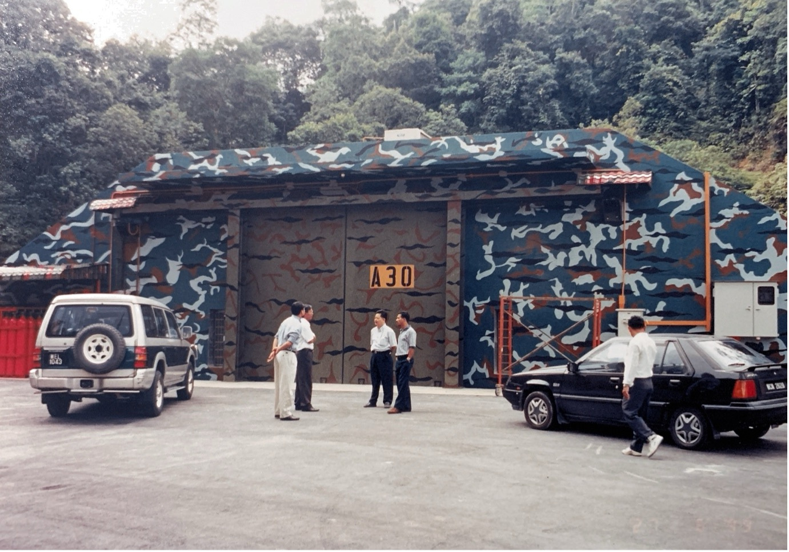
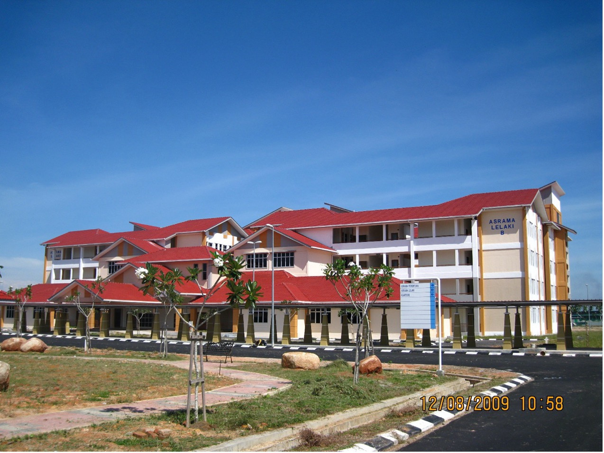

# KAMALBINA SDN. BHD.

**THE NAME THAT BUILDS CONFIDENCE**

Delivering high-impact construction and infrastructure projects across Malaysia since 1984.

* **G7 CIDB CONTRACTOR**
* **ISO 9001:2015 CERTIFIED**

---

## FOREWORD BY MANAGING DIRECTOR

**TAN SRI KAMARULBAHRAIN BIN ZAINUDDIN**
*Managing Director, Kamalbina Sdn. Bhd.*

> "Built on experience. Driven by excellence."

Since our establishment in 1984, Kamalbina Sdn. Bhd. has grown steadily to become a trusted name in Malaysia's construction industry. What began as a modest operation has evolved into a CIDB Grade G7 contractor with the capability to undertake projects of unlimited value.

Over the years, we have successfully delivered a wide range of projects across building construction, civil engineering, and infrastructure works. Our involvement in government and private sector developments reflects the confidence placed in us by our clients and stakeholders.

At Kamalbina, we believe that strong fundamentals are the key to sustainable success. Our commitment to quality, safety, and disciplined project management is reinforced through our ISO 9001:2015 certification and CIDB SCORE rating. These are not merely recognitions, but a reflection of the standards we uphold in every project we undertake.

As we continue to grow, we remain focused on strengthening our technical capabilities, enhancing operational efficiency, and embracing continuous improvement. Our goal is not only to meet expectations, but to consistently deliver projects that create long-term value for our clients and the communities we serve.

I would like to take this opportunity to express my sincere appreciation to our clients, partners, and dedicated team members whose trust and commitment have been instrumental in our journey.

We look forward to building stronger partnerships and delivering greater milestones in the years ahead.

---

## COMPANY SNAPSHOT

Kamalbina Sdn. Bhd. is a CIDB Grade G7 contractor with over 40 years of experience in delivering construction and infrastructure projects across Malaysia.

### KEY INFORMATION
* **Established Year:** 1984
* **CIDB Registration:** G7
* **ISO Certification:** ISO 9001:2015
* **CIDB SCORE Rating:** 3 Star

### CORE SERVICES
* Building Construction
* Civil Engineering
* Infrastructure Works
* Design & Build

### PROJECT CAPABILITY
* High-Rise & Institutional Buildings
* Healthcare Facilities (Hospitals & Clinics)
* Road & Infrastructure Works
* Government & Public Sector Projects

### HEAD OFFICE
Level 5, Menara Kamalbina
Jalan Maharajalela
34000 Taiping, Perak.

### STRENGTH AT A GLANCE
* **40+** Years of Experience
* **50** Completed Projects
* Government & Private Sectors
* Proven Track Record Projects from Residential to Government
* Project Management Team

### OUR COMMITMENT
To construct high-performance environments that preserve community value, enhance the quality of life and deliver lasting impact to our partners and society.

---

## COMPANY OVERVIEW

Kamalbina Sdn. Bhd. is a CIDB Grade G7 contractor delivering high-quality construction and infrastructure projects across Malaysia, backed by over 40 years of industry experience.

### DELIVERING VALUE
We focus on delivering reliable, efficient, and high-quality construction solutions that meet client expectations and contribute to long-term development.

### INDUSTRY EXPERIENCE
With a strong track record in government and private sector projects, Kamalbina has successfully delivered projects ranging from institutional buildings to large-scale infrastructure works.

### OUR STRENGTH
* Proven project delivery capability
* Experienced technical and management team
* Long-standing industry presence

---

## COMPANY HISTORY
**BUILDING A LEGACY SINCE 1984**

With over four decades of experience, Kamalbina Sdn. Bhd. has evolved from a local contractor to a trusted construction partner, delivering quality projects for government and private sectors across Malaysia.

* **1984: ESTABLISHMENT**
  On 20 November 1984, Kamalbina Sdn. Bhd. was officially established, marking the beginning of our corporate identity and commitment to quality construction services.
* **1991: CORPORATE TRANSFORMATION**
  In 1991, Kamalbina Sdn. Bhd. successfully registered under Pusat Khidmat Kontraktor (PKK), marking the beginning of our active involvement in government tendering and public sector projects.
* **1998: CONTRACTOR G7 ACHIEVED**
  Kamalbina Sdn. Bhd. was registered as a CIDB Grade G7 contractor, enabling us to undertake projects of unlimited value across multiple categories.
* **2003: GROWTH & RECOGNITION**
  Achieved ISO 9001:2010 certification, reinforcing our commitment to a quality management system and continuous improvement.
* **2012: CIDB SCORE 3-STAR RATING**
  Awarded CIDB SCORE 3-Star Rating, recognising our strong performance in management capability, technical expertise and project execution.
* **TODAY: CONTINUOUS EXCELLENCE**
  Today, Kamalbina Sdn. Bhd. continues to deliver high-quality construction and infrastructure projects across Malaysia, upholding our core values of integrity, quality, safety, and reliability for the benefit of our clients and the nation.

### OUR JOURNEY CONTINUES
Built on experience. Driven by excellence. Committed to delivering lasting value.
* **INTEGRITY**: We conduct our business with honesty and transparency.
* **QUALITY**: We deliver work of the highest standards with attention to detail.
* **SAFETY**: We prioritize the well-being of our people and the public.
* **RELIABILITY**: We are a partner our clients can count on, every step of the way.

---

## CURRENT PROJECTS
**ACTIVE. COMMITTED. DELIVERING.**

Kamalbina Sdn. Bhd. is currently executing the following projects with full commitment to quality, safety, and timely delivery.

### 01: PEMBINAAN BANGUNAN STOR FARMASI LOGISTIK DAN FARMASI STERIL HOSPITAL TAIPING, PERAK (REKA & BINA)
* **CLIENT**: Kementerian Kesihatan Malaysia (KKM)
* **LOCATION**: Taiping, Perak
* **CONTRACT VALUE**: RM 25,977,000.00
* **CONTRACT PERIOD**: 25 November 2022 – 24 July 2026 (44 Months)
* **SCOPE OF WORK**: Building and Infrastructure Construction

### 02: PEMBANGUNAN BAHARU PEJABAT PENDIDIKAN DAERAH BARAT DAYA, BARAT DAYA, PULAU PINANG (REKA & BINA)
* **CLIENT**: Kementerian Pendidikan Malaysia (KPM)
* **LOCATION**: Daerah Barat Daya, Pulau Pinang
* **CONTRACT VALUE**: RM 32,477,000.00
* **CONTRACT PERIOD**: 10 September 2025 – 7 March 2028 (30 Months)
* **SCOPE OF WORK**: Building and Infrastructure Construction

**2 ACTIVE PROJECTS**
**Total Contract Value**: RM 58,454,000.00

* **ON SCHEDULE & ON TRACK**: Continuous monitoring ensures projects are progressing according to plan.
* **QUALITY & SAFETY PRIORITY**: We uphold the highest standards in quality, safety, and environmental compliance.

---

## SELECTED PROJECT EXPERIENCE
Delivering high-quality construction and infrastructure projects with excellence and integrity across Malaysia.

### 01: BLOK TAMABAHAN HOSPITAL SERI MANJUNG

* **Project Type**: Hospital (Design & Build)
* **Location**: Manjung, Perak
* **Year Completed**: 2024
* **CONTRACT VALUE**: RM66.277 Million

### 02: HOSPITAL RAJA PERMAISURI BAINUN, IPOH

* **Project Type**: Hospital
* **Location**: Ipoh, Perak
* **Year Completed**: 2019
* **CONTRACT VALUE**: RM237 Million

### 03: BANGUNAN BUNKER DAN BANGUNAN STOR TLDM, LUMUT

* **Project Type**: Military Bunker & Store
* **Location**: Lumut, Perak
* **Year Completed**: 2010
* **CONTRACT VALUE**: RM21.717 Million

### 04: PUSAT LATIHAN TEKNOLOGI TINGGI (ADTEC), TAIPING

* **Project Type**: Higher Institution
* **Location**: Taiping, Perak
* **Year Completed**: 2009
* **CONTRACT VALUE**: RM160 Million

---

## CREDENTIALS & INDUSTRY RECOGNITION
Our certifications and recognitions reflect our commitment to quality, compliance, safety and continuous improvement in all that we do.

* **CIDB G7 Contractor (Grade G7)**: Unlimited tendering capacity for projects of unlimited value.
* **ISO 9001:2015**: Quality Management System. Ensuring consistent quality, process efficiency and customer satisfaction.
* **CIDB SCORE 3-Star Rating**: Recognised performance in construction capability and project management.

### AWARDS & RECOGNITION
* ANUGERAH INOVASI JKR MALAYSIA
* CIDB EXCELLENCE AWARDS
* SAFETY & HEALTH RECOGNITION
* EXCELLENCE IN PROJECT DELIVERY

> "We continuously uphold the highest standards of quality, safety and professionalism to deliver projects that create lasting value for our clients and the nation."

### CERTIFICATIONS & REGISTRATIONS (Appended Documents)
The company profile includes official copies of the following certificates:
* CIDB Sijil Perolehan Kerja Kerajaan
* CIDB Perakuan Pendaftaran
* Pusat Khidmat Kontraktor - Sijil Taraf Bumiputera
* SME Corp & CIDB Certificate of Achievement (SCORE 3 Star)
* ISO 9001:2015 Certificate of Registration (URS)
* JKR & CREaTE Sijil Kompetensi (Kontraktor Kesihatan - SKKK)
* Kementerian Kerja Raya - Sijil Kontraktor Penyiap
* LHDN Sijil Pematuhan Cukai (TCC)

---

## LEADERSHIP & CONTACT
Our leadership is defined by extensive industry experience, technical expertise and strong values, ensuring excellence in every project.

### MANAGING DIRECTOR
**TAN SRI KAMARULBAHRAIN BIN ZAINUDDIN**

### OUR APPROACH
We emphasise strong leadership, technical competence, innovative solutions and disciplined project management to deliver consistent results across all our projects.

### BUILD WITH CONFIDENCE
Partner with Kamalbina for reliable, high-quality construction solutions backed by proven experience.

### GET IN TOUCH
* **Address**: Kamalbina Sdn. Bhd., Level 5, Menara Kamalbina, Jalan Maharajalela, 34000 Taiping, Perak, Malaysia
* **Tel**: 05-806 6789 / 05-807 6789
* **Email**: kamalbinasb@yahoo.com
